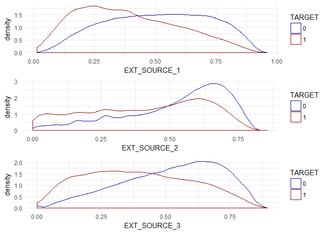
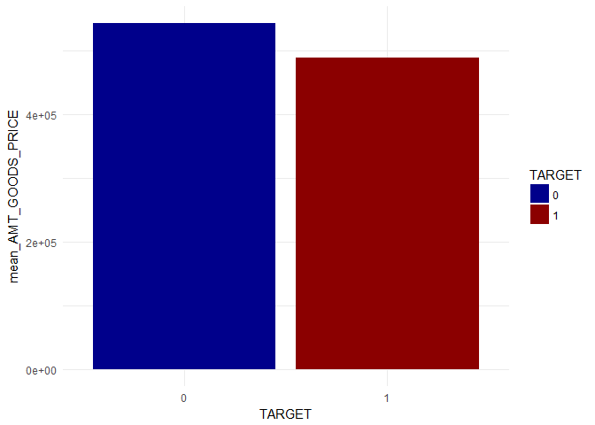
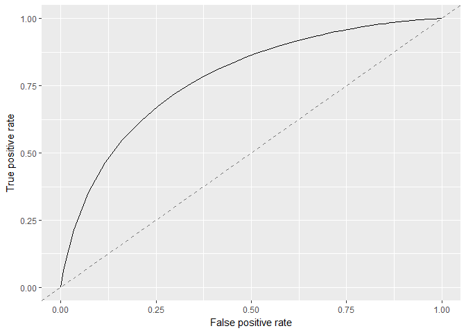

#### Packages

    library(dplyr)
    library(caret)
    library(parallel)
    library(parallelMap) 
    library(mlr)
    library(mlrMBO)
    library(woeBinning)
    library(DataExplorer)
    library(gridExtra)
    library(knitr)
    library(reshape)

1 Reading the data
------------------

    load("../Data Wrangling/train_final.Rda")
    load("../Data Wrangling/test_final.Rda")
    load("../Data Wrangling/full_final.Rda")

2 Exploratory data analyses
---------------------------

-   Getting an initial overview of the data.

<!-- -->

    glimpse(train)

    ## Observations: 307,511
    ## Variables: 348
    ## $ SK_ID_CURR                                    <int> 100002, 100003, ...
    ## $ TARGET                                        <fct> 1, 0, 0, 0, 0, 0...
    ## $ NAME_CONTRACT_TYPE                            <fct> Cash loans, Cash...
    ## $ CODE_GENDER                                   <fct> M, F, M, F, M, M...
    ## $ FLAG_OWN_CAR                                  <fct> N, N, Y, N, N, N...
    ## $ FLAG_OWN_REALTY                               <fct> Y, N, Y, Y, Y, Y...
    ## $ CNT_CHILDREN                                  <int> 0, 0, 0, 0, 0, 0...
    ## $ AMT_INCOME_TOTAL                              <dbl> 202500.00, 27000...
    ## $ AMT_CREDIT                                    <dbl> 406597.5, 129350...
    ## $ AMT_ANNUITY                                   <dbl> 24700.5, 35698.5...
    ## $ AMT_GOODS_PRICE                               <dbl> 351000, 1129500,...
    ## $ NAME_TYPE_SUITE                               <fct> Unaccompanied, F...
    ## $ NAME_INCOME_TYPE                              <fct> Working, State s...
    ## $ NAME_EDUCATION_TYPE                           <fct> Secondary / seco...
    ## $ NAME_FAMILY_STATUS                            <fct> Single / not mar...
    ## $ NAME_HOUSING_TYPE                             <fct> House / apartmen...
    ## $ REGION_POPULATION_RELATIVE                    <dbl> 0.018801, 0.0035...
    ## $ DAYS_BIRTH                                    <int> -9461, -16765, -...
    ## $ DAYS_EMPLOYED                                 <int> -637, -1188, -22...
    ## $ DAYS_REGISTRATION                             <dbl> -3648, -1186, -4...
    ## $ DAYS_ID_PUBLISH                               <int> -2120, -291, -25...
    ## $ OWN_CAR_AGE                                   <dbl> NA, NA, 26, NA, ...
    ## $ FLAG_MOBIL                                    <int> 1, 1, 1, 1, 1, 1...
    ## $ FLAG_EMP_PHONE                                <int> 1, 1, 1, 1, 1, 1...
    ## $ FLAG_WORK_PHONE                               <int> 0, 0, 1, 0, 0, 1...
    ## $ FLAG_CONT_MOBILE                              <int> 1, 1, 1, 1, 1, 1...
    ## $ FLAG_PHONE                                    <int> 1, 1, 1, 0, 0, 1...
    ## $ FLAG_EMAIL                                    <int> 0, 0, 0, 0, 0, 0...
    ## $ OCCUPATION_TYPE                               <fct> Laborers, Core s...
    ## $ CNT_FAM_MEMBERS                               <dbl> 1, 2, 1, 2, 1, 2...
    ## $ REGION_RATING_CLIENT                          <int> 2, 1, 2, 2, 2, 2...
    ## $ REGION_RATING_CLIENT_W_CITY                   <int> 2, 1, 2, 2, 2, 2...
    ## $ WEEKDAY_APPR_PROCESS_START                    <fct> WEDNESDAY, MONDA...
    ## $ HOUR_APPR_PROCESS_START                       <int> 10, 11, 9, 17, 1...
    ## $ REG_REGION_NOT_LIVE_REGION                    <int> 0, 0, 0, 0, 0, 0...
    ## $ REG_REGION_NOT_WORK_REGION                    <int> 0, 0, 0, 0, 0, 0...
    ## $ LIVE_REGION_NOT_WORK_REGION                   <int> 0, 0, 0, 0, 0, 0...
    ## $ REG_CITY_NOT_LIVE_CITY                        <int> 0, 0, 0, 0, 0, 0...
    ## $ REG_CITY_NOT_WORK_CITY                        <int> 0, 0, 0, 0, 1, 0...
    ## $ LIVE_CITY_NOT_WORK_CITY                       <int> 0, 0, 0, 0, 1, 0...
    ## $ ORGANIZATION_TYPE                             <fct> Business Entity ...
    ## $ EXT_SOURCE_1                                  <dbl> 0.08303697, 0.31...
    ## $ EXT_SOURCE_2                                  <dbl> 0.2629486, 0.622...
    ## $ EXT_SOURCE_3                                  <dbl> 0.13937578, NA, ...
    ## $ APARTMENTS_AVG                                <dbl> 0.0247, 0.0959, ...
    ## $ BASEMENTAREA_AVG                              <dbl> 0.0369, 0.0529, ...
    ## $ YEARS_BEGINEXPLUATATION_AVG                   <dbl> 0.9722, 0.9851, ...
    ## $ YEARS_BUILD_AVG                               <dbl> 0.6192, 0.7960, ...
    ## $ COMMONAREA_AVG                                <dbl> 0.0143, 0.0605, ...
    ## $ ELEVATORS_AVG                                 <dbl> 0.00, 0.08, NA, ...
    ## $ ENTRANCES_AVG                                 <dbl> 0.0690, 0.0345, ...
    ## $ FLOORSMAX_AVG                                 <dbl> 0.0833, 0.2917, ...
    ## $ FLOORSMIN_AVG                                 <dbl> 0.1250, 0.3333, ...
    ## $ LANDAREA_AVG                                  <dbl> 0.0369, 0.0130, ...
    ## $ LIVINGAPARTMENTS_AVG                          <dbl> 0.0202, 0.0773, ...
    ## $ LIVINGAREA_AVG                                <dbl> 0.0190, 0.0549, ...
    ## $ NONLIVINGAPARTMENTS_AVG                       <dbl> 0.0000, 0.0039, ...
    ## $ NONLIVINGAREA_AVG                             <dbl> 0.0000, 0.0098, ...
    ## $ APARTMENTS_MODE                               <dbl> 0.0252, 0.0924, ...
    ## $ BASEMENTAREA_MODE                             <dbl> 0.0383, 0.0538, ...
    ## $ YEARS_BEGINEXPLUATATION_MODE                  <dbl> 0.9722, 0.9851, ...
    ## $ YEARS_BUILD_MODE                              <dbl> 0.6341, 0.8040, ...
    ## $ COMMONAREA_MODE                               <dbl> 0.0144, 0.0497, ...
    ## $ ELEVATORS_MODE                                <dbl> 0.0000, 0.0806, ...
    ## $ ENTRANCES_MODE                                <dbl> 0.0690, 0.0345, ...
    ## $ FLOORSMAX_MODE                                <dbl> 0.0833, 0.2917, ...
    ## $ FLOORSMIN_MODE                                <dbl> 0.1250, 0.3333, ...
    ## $ LANDAREA_MODE                                 <dbl> 0.0377, 0.0128, ...
    ## $ LIVINGAPARTMENTS_MODE                         <dbl> 0.0220, 0.0790, ...
    ## $ LIVINGAREA_MODE                               <dbl> 0.0198, 0.0554, ...
    ## $ NONLIVINGAPARTMENTS_MODE                      <dbl> 0.0000, 0.0000, ...
    ## $ NONLIVINGAREA_MODE                            <dbl> 0.0000, 0.0000, ...
    ## $ APARTMENTS_MEDI                               <dbl> 0.0250, 0.0968, ...
    ## $ BASEMENTAREA_MEDI                             <dbl> 0.0369, 0.0529, ...
    ## $ YEARS_BEGINEXPLUATATION_MEDI                  <dbl> 0.9722, 0.9851, ...
    ## $ YEARS_BUILD_MEDI                              <dbl> 0.6243, 0.7987, ...
    ## $ COMMONAREA_MEDI                               <dbl> 0.0144, 0.0608, ...
    ## $ ELEVATORS_MEDI                                <dbl> 0.00, 0.08, NA, ...
    ## $ ENTRANCES_MEDI                                <dbl> 0.0690, 0.0345, ...
    ## $ FLOORSMAX_MEDI                                <dbl> 0.0833, 0.2917, ...
    ## $ FLOORSMIN_MEDI                                <dbl> 0.1250, 0.3333, ...
    ## $ LANDAREA_MEDI                                 <dbl> 0.0375, 0.0132, ...
    ## $ LIVINGAPARTMENTS_MEDI                         <dbl> 0.0205, 0.0787, ...
    ## $ LIVINGAREA_MEDI                               <dbl> 0.0193, 0.0558, ...
    ## $ NONLIVINGAPARTMENTS_MEDI                      <dbl> 0.0000, 0.0039, ...
    ## $ NONLIVINGAREA_MEDI                            <dbl> 0.0000, 0.0100, ...
    ## $ FONDKAPREMONT_MODE                            <fct> reg oper account...
    ## $ HOUSETYPE_MODE                                <fct> block of flats, ...
    ## $ TOTALAREA_MODE                                <dbl> 0.0149, 0.0714, ...
    ## $ WALLSMATERIAL_MODE                            <fct> Stone, brick, Bl...
    ## $ EMERGENCYSTATE_MODE                           <fct> No, No, NA, NA, ...
    ## $ OBS_30_CNT_SOCIAL_CIRCLE                      <dbl> 2, 1, 0, 2, 0, 0...
    ## $ DEF_30_CNT_SOCIAL_CIRCLE                      <dbl> 2, 0, 0, 0, 0, 0...
    ## $ OBS_60_CNT_SOCIAL_CIRCLE                      <dbl> 2, 1, 0, 2, 0, 0...
    ## $ DEF_60_CNT_SOCIAL_CIRCLE                      <dbl> 2, 0, 0, 0, 0, 0...
    ## $ DAYS_LAST_PHONE_CHANGE                        <dbl> -1134, -828, -81...
    ## $ FLAG_DOCUMENT_2                               <int> 0, 0, 0, 0, 0, 0...
    ## $ FLAG_DOCUMENT_3                               <int> 1, 1, 0, 1, 0, 1...
    ## $ FLAG_DOCUMENT_4                               <int> 0, 0, 0, 0, 0, 0...
    ## $ FLAG_DOCUMENT_5                               <int> 0, 0, 0, 0, 0, 0...
    ## $ FLAG_DOCUMENT_6                               <int> 0, 0, 0, 0, 0, 0...
    ## $ FLAG_DOCUMENT_7                               <int> 0, 0, 0, 0, 0, 0...
    ## $ FLAG_DOCUMENT_8                               <int> 0, 0, 0, 0, 1, 0...
    ## $ FLAG_DOCUMENT_9                               <int> 0, 0, 0, 0, 0, 0...
    ## $ FLAG_DOCUMENT_10                              <int> 0, 0, 0, 0, 0, 0...
    ## $ FLAG_DOCUMENT_11                              <int> 0, 0, 0, 0, 0, 0...
    ## $ FLAG_DOCUMENT_12                              <int> 0, 0, 0, 0, 0, 0...
    ## $ FLAG_DOCUMENT_13                              <int> 0, 0, 0, 0, 0, 0...
    ## $ FLAG_DOCUMENT_14                              <int> 0, 0, 0, 0, 0, 0...
    ## $ FLAG_DOCUMENT_15                              <int> 0, 0, 0, 0, 0, 0...
    ## $ FLAG_DOCUMENT_16                              <int> 0, 0, 0, 0, 0, 0...
    ## $ FLAG_DOCUMENT_17                              <int> 0, 0, 0, 0, 0, 0...
    ## $ FLAG_DOCUMENT_18                              <int> 0, 0, 0, 0, 0, 0...
    ## $ FLAG_DOCUMENT_19                              <int> 0, 0, 0, 0, 0, 0...
    ## $ FLAG_DOCUMENT_20                              <int> 0, 0, 0, 0, 0, 0...
    ## $ FLAG_DOCUMENT_21                              <int> 0, 0, 0, 0, 0, 0...
    ## $ AMT_REQ_CREDIT_BUREAU_HOUR                    <dbl> 0, 0, 0, NA, 0, ...
    ## $ AMT_REQ_CREDIT_BUREAU_DAY                     <dbl> 0, 0, 0, NA, 0, ...
    ## $ AMT_REQ_CREDIT_BUREAU_WEEK                    <dbl> 0, 0, 0, NA, 0, ...
    ## $ AMT_REQ_CREDIT_BUREAU_MON                     <dbl> 0, 0, 0, NA, 0, ...
    ## $ AMT_REQ_CREDIT_BUREAU_QRT                     <dbl> 0, 0, 0, NA, 0, ...
    ## $ AMT_REQ_CREDIT_BUREAU_YEAR                    <dbl> 1, 0, 0, NA, 0, ...
    ## $ card_months_balance                           <dbl> NA, NA, NA, -3.5...
    ## $ card_amt_balance                              <dbl> NA, NA, NA, 0.00...
    ## $ card_amt_credit_limit_actual                  <dbl> NA, NA, NA, 2700...
    ## $ card_amt_drawings_atm_current                 <dbl> NA, NA, NA, 0.00...
    ## $ card_amt_drawings_current                     <dbl> NA, NA, NA, 0.00...
    ## $ card_amt_drawings_other_current               <dbl> NA, NA, NA, 0, N...
    ## $ card_amt_drawings_pos_current                 <dbl> NA, NA, NA, 0, N...
    ## $ card_amt_inst_min_regularity                  <dbl> NA, NA, NA, 0.00...
    ## $ card_amt_payment_current                      <dbl> NA, NA, NA, 0.00...
    ## $ card_amt_payment_total_current                <dbl> NA, NA, NA, 0.00...
    ## $ card_amt_receivable_principal                 <dbl> NA, NA, NA, 0, N...
    ## $ card_amt_recivable                            <dbl> NA, NA, NA, 0, N...
    ## $ card_amt_total_receivable                     <dbl> NA, NA, NA, 0, N...
    ## $ card_cnt_drawings_current                     <dbl> NA, NA, NA, 0.00...
    ## $ card_cnt_drawings_amt_current                 <dbl> NA, NA, NA, 0.00...
    ## $ card_cnt_drawings_other_current               <dbl> NA, NA, NA, 0, N...
    ## $ card_cnt_drawings_pos_current                 <dbl> NA, NA, NA, 0, N...
    ## $ card_cnt_instalment_mature_cum                <dbl> NA, NA, NA, 0.00...
    ## $ Active.x                                      <dbl> NA, NA, NA, 1.00...
    ## $ Approved.x                                    <dbl> NA, NA, NA, 0, N...
    ## $ Completed.x                                   <dbl> NA, NA, NA, 0.00...
    ## $ Demand.x                                      <dbl> NA, NA, NA, 0, N...
    ## $ Refused.x                                     <dbl> NA, NA, NA, 0, N...
    ## $ Sent.proposal                                 <dbl> NA, NA, NA, 0, N...
    ## $ Signed.x                                      <dbl> NA, NA, NA, 0, N...
    ## $ card_sk_dpd                                   <dbl> NA, NA, NA, 0, N...
    ## $ card_sk_dpd_def                               <dbl> NA, NA, NA, 0, N...
    ## $ bureau_credit_active                          <dbl> 2, 1, 0, NA, 0, ...
    ## $ currency.1                                    <dbl> 1, 1, 1, NA, 1, ...
    ## $ currency.2                                    <dbl> 0, 0, 0, NA, 0, ...
    ## $ currency.3                                    <dbl> 0, 0, 0, NA, 0, ...
    ## $ currency.4                                    <dbl> 0, 0, 0, NA, 0, ...
    ## $ bureau_days_credit                            <dbl> -874.0000, -1400...
    ## $ bureau_credit_day_overdue                     <dbl> 0, 0, 0, NA, 0, ...
    ## $ bureau_day_credit_endate                      <dbl> NA, 1216, 0, NA,...
    ## $ bureau_amt_credit_max_overdue                 <dbl> 1681.029, 0.000,...
    ## $ bureau_cnt_credit_prolong                     <dbl> 0, 0, 0, NA, 0, ...
    ## $ bureau_amt_credit_sum                         <dbl> 108131.95, 25435...
    ## $ bureau_amt_credit_sum_dept                    <dbl> NA, 0.0, 0.0, NA...
    ## $ bureau_amt_credit_sum_limit                   <dbl> NA, 810000, 0, N...
    ## $ bureau_amt_credit_sum_overdue                 <dbl> 0, 0, 0, NA, 0, ...
    ## $ Another.type.of.loan                          <dbl> 0, 0, 0, NA, 0, ...
    ## $ Car.loan                                      <dbl> 0, 0, 0, NA, 0, ...
    ## $ Cash.loan..non.earmarked.                     <dbl> 0, 0, 0, NA, 0, ...
    ## $ Consumer.credit                               <dbl> 0.5000000, 0.500...
    ## $ Credit.card                                   <dbl> 0.5000000, 0.500...
    ## $ Interbank.credit                              <dbl> 0, 0, 0, NA, 0, ...
    ## $ Loan.for.business.development                 <dbl> 0.0, 0.0, 0.0, N...
    ## $ Loan.for.purchase.of.shares..margin.lending.  <dbl> 0, 0, 0, NA, 0, ...
    ## $ Loan.for.the.purchase.of.equipment            <dbl> 0, 0, 0, NA, 0, ...
    ## $ Loan.for.working.capital.replenishment        <dbl> 0, 0, 0, NA, 0, ...
    ## $ Microloan                                     <dbl> 0.0000000, 0.000...
    ## $ Mobile.operator.loan                          <dbl> 0, 0, 0, NA, 0, ...
    ## $ Mortgage                                      <dbl> 0.0, 0.0, 0.0, N...
    ## $ Real.estate.loan                              <dbl> 0, 0, 0, NA, 0, ...
    ## $ Unknown.type.of.loan                          <dbl> 0, 0, 0, NA, 0, ...
    ## $ bureau_days_credit_update                     <dbl> -499.8750, -816....
    ## $ bureau_amt_annuity                            <dbl> 0, 0, 0, NA, 0, ...
    ## $ pos_month_balance                             <dbl> -10.000000, -43....
    ## $ pos_cnt_instalment                            <dbl> 24.000000, 10.10...
    ## $ pos_cnt_instalment_future                     <dbl> 285, 162, 9, 173...
    ## $ Active.y                                      <dbl> 1.0000000, 0.928...
    ## $ Amortized.debt                                <dbl> 0, 0, 0, 0, 0, 0...
    ## $ Approved.y                                    <dbl> 0, 0, 0, 0, 0, 0...
    ## $ Canceled.x                                    <dbl> 0, 0, 0, 0, 0, 0...
    ## $ Completed.y                                   <dbl> 0.00000000, 0.07...
    ## $ Demand.y                                      <dbl> 0, 0, 0, 0, 0, 0...
    ## $ Returned.to.the.store                         <dbl> 0.00000000, 0.00...
    ## $ Signed.y                                      <dbl> 0.00000000, 0.00...
    ## $ xna.name.contract.status                      <dbl> 0, 0, 0, 0, 0, 0...
    ## $ pos_sk_dpd                                    <dbl> 0.000000, 0.0000...
    ## $ pos_sk_dpd_def                                <dbl> 0.0000000, 0.000...
    ## $ Cash.loans                                    <dbl> 0.0000000, 0.333...
    ## $ Consumer.loans                                <dbl> 1.0000000, 0.666...
    ## $ Revolving.loans                               <dbl> 0.0000000, 0.000...
    ## $ xna.name.contract.type                        <dbl> 0, 0, 0, 0, 0, 0...
    ## $ prev_amt_annuity                              <dbl> 9251.775, 56553....
    ## $ prev_amt_application                          <dbl> 179055.00, 43543...
    ## $ prev_amt_credit                               <dbl> 179055.00, 48419...
    ## $ prev_amt_down_payment                         <dbl> 0.000, 3442.500,...
    ## $ prev_amt_goods_price                          <dbl> 179055.00, 43543...
    ## $ prev_rate_down_payment                        <dbl> 0.00000000, 0.05...
    ## $ prev_rate_interest_primary                    <dbl> 0, 0, 0, 0, 0, 0...
    ## $ prev_rate_interest_privileged                 <dbl> 0, 0, 0, 0, 0, 0...
    ## $ Building.a.house.or.an.annex                  <dbl> 0, 0, 0, 0, 0, 0...
    ## $ Business.development                          <dbl> 0, 0, 0, 0, 0, 0...
    ## $ Buying.a.garage                               <dbl> 0, 0, 0, 0, 0, 0...
    ## $ Buying.a.holiday.home...land                  <dbl> 0, 0, 0, 0, 0, 0...
    ## $ Buying.a.home                                 <dbl> 0, 0, 0, 0, 0, 0...
    ## $ Buying.a.new.car                              <dbl> 0, 0, 0, 0, 0, 0...
    ## $ Buying.a.used.car                             <dbl> 0, 0, 0, 0, 0, 0...
    ## $ Car.repairs                                   <dbl> 0, 0, 0, 0, 0, 0...
    ## $ Education.x                                   <dbl> 0, 0, 0, 0, 0, 0...
    ## $ Everyday.expenses                             <dbl> 0, 0, 0, 0, 0, 0...
    ## $ Furniture.x                                   <dbl> 0, 0, 0, 0, 0, 0...
    ## $ Gasification...water.supply                   <dbl> 0, 0, 0, 0, 0, 0...
    ## $ Hobby                                         <dbl> 0, 0, 0, 0, 0, 0...
    ## $ Journey                                       <dbl> 0, 0, 0, 0, 0, 0...
    ## $ Medicine.x                                    <dbl> 0, 0, 0, 0, 0, 0...
    ## $ Money.for.a.third.person                      <dbl> 0, 0, 0, 0, 0, 0...
    ## $ Other.x                                       <dbl> 0, 0, 0, 0, 0, 0...
    ## $ Payments.on.other.loans                       <dbl> 0, 0, 0, 0, 0, 0...
    ## $ Purchase.of.electronic.equipment              <dbl> 0, 0, 0, 0, 0, 0...
    ## $ Refusal.to.name.the.goal                      <dbl> 0, 0, 0, 0, 0, 0...
    ## $ Repairs                                       <dbl> 0, 0, 0, 0, 0, 0...
    ## $ Urgent.needs                                  <dbl> 0, 0, 0, 0, 0, 0...
    ## $ Wedding...gift...holiday                      <dbl> 0, 0, 0, 0, 0, 0...
    ## $ xap.name.cash.loan.purpose                    <dbl> 1.0000000, 0.666...
    ## $ xnp.name.cash.loan.purpose                    <dbl> 0.0000000, 0.333...
    ## $ Approved                                      <dbl> 1.0000000, 1.000...
    ## $ Canceled.y                                    <dbl> 0.0000000, 0.000...
    ## $ Refused.y                                     <dbl> 0.0000000, 0.000...
    ## $ Unused.offer                                  <dbl> 0, 0, 0, 0, 0, 0...
    ## $ prev_days_decision                            <dbl> -606.0000, -1305...
    ## $ Cash.through.the.bank                         <dbl> 0.0000000, 0.666...
    ## $ Cashless.from.the.account.of.the.employer     <dbl> 0, 0, 0, 0, 0, 0...
    ## $ Non.cash.from.your.account                    <dbl> 0, 0, 0, 0, 0, 0...
    ## $ xna.name.payment.type                         <dbl> 1.0000000, 0.333...
    ## $ CLIENT                                        <dbl> 0, 0, 0, 0, 0, 0...
    ## $ HC                                            <dbl> 0.00, 0.00, 0.00...
    ## $ LIMIT                                         <dbl> 0.0000000, 0.000...
    ## $ SCO                                           <dbl> 0, 0, 0, 0, 0, 0...
    ## $ SCOFR                                         <dbl> 0, 0, 0, 0, 0, 0...
    ## $ SYSTEM                                        <dbl> 0, 0, 0, 0, 0, 0...
    ## $ VERIF                                         <dbl> 0, 0, 0, 0, 0, 0...
    ## $ xap.code.reject.reason                        <dbl> 1.0000000, 1.000...
    ## $ xna.code.reject.reason                        <dbl> 0, 0, 0, 0, 0, 0...
    ## $ V1.x                                          <dbl> 1.0000000, 0.000...
    ## $ Children                                      <dbl> 0.00, 0.00, 0.00...
    ## $ Family                                        <dbl> 0.0000000, 0.666...
    ## $ Group.of.people                               <dbl> 0, 0, 0, 0, 0, 0...
    ## $ Other_A                                       <dbl> 0.0, 0.0, 0.0, 0...
    ## $ Other_B                                       <dbl> 0.00, 0.00, 0.00...
    ## $ Spouse..partner                               <dbl> 0.0000000, 0.000...
    ## $ Unaccompanied                                 <dbl> 0.0000000, 0.333...
    ## $ Additional.Service                            <dbl> 0, 0, 0, 0, 0, 0...
    ## $ Animals                                       <dbl> 0, 0, 0, 0, 0, 0...
    ## $ Audio.Video                                   <dbl> 0.0000000, 0.000...
    ## $ Auto.Accessories                              <dbl> 0, 0, 0, 0, 0, 0...
    ## $ Clothing.and.Accessories                      <dbl> 0.00, 0.00, 0.00...
    ## $ Computers                                     <dbl> 0.0000000, 0.000...
    ## $ Construction.Materials                        <dbl> 0.0000000, 0.000...
    ## $ Consumer.Electronics                          <dbl> 0.0000000, 0.333...
    ## $ Direct.Sales                                  <dbl> 0, 0, 0, 0, 0, 0...
    ## $ Education.y                                   <dbl> 0, 0, 0, 0, 0, 0...
    ## $ Fitness                                       <dbl> 0, 0, 0, 0, 0, 0...
    ## $ Furniture.y                                   <dbl> 0.0000000, 0.333...
    ## $ Gardening                                     <dbl> 0.0, 0.0, 0.0, 0...
    ## $ Homewares                                     <dbl> 0, 0, 0, 0, 0, 0...
    ## $ House.Construction                            <dbl> 0, 0, 0, 0, 0, 0...
    ## $ Insurance                                     <dbl> 0, 0, 0, 0, 0, 0...
    ## $ Jewelry.x                                     <dbl> 0, 0, 0, 0, 0, 0...
    ## $ Medical.Supplies                              <dbl> 0, 0, 0, 0, 0, 0...
    ## $ Medicine.y                                    <dbl> 0, 0, 0, 0, 0, 0...
    ## $ Mobile                                        <dbl> 0.0000000, 0.000...
    ## $ Office.Appliances                             <dbl> 0, 0, 0, 0, 0, 0...
    ## $ Other.y                                       <dbl> 0, 0, 0, 0, 0, 0...
    ## $ Photo...Cinema.Equipment                      <dbl> 0.0000000, 0.000...
    ## $ Sport.and.Leisure                             <dbl> 0, 0, 0, 0, 0, 0...
    ## $ Tourism.x                                     <dbl> 0, 0, 0, 0, 0, 0...
    ## $ Vehicles                                      <dbl> 1, 0, 0, 0, 0, 0...
    ## $ Weapon                                        <dbl> 0, 0, 0, 0, 0, 0...
    ## $ xna.name.goods.category                       <dbl> 0.0000000, 0.333...
    ## $ Cards                                         <dbl> 0.0000000, 0.000...
    ## $ Cars                                          <dbl> 0, 0, 0, 0, 0, 0...
    ## $ Cash.x                                        <dbl> 0.0000000, 0.333...
    ## $ POS                                           <dbl> 1.0000000, 0.666...
    ## $ xna.name.portfolio                            <dbl> 0.0000000, 0.000...
    ## $ walk.in                                       <dbl> 0.0000000, 0.000...
    ## $ x.sell                                        <dbl> 0.0000000, 0.333...
    ## $ xna.name.product.type                         <dbl> 1.0000000, 0.666...
    ## $ AP...Cash.loan.                               <dbl> 0.0000000, 0.000...
    ## $ Car.dealer                                    <dbl> 0, 0, 0, 0, 0, 0...
    ## $ Channel.of.corporate.sales                    <dbl> 0, 0, 0, 0, 0, 0...
    ## $ Contact.center                                <dbl> 0.00, 0.00, 0.00...
    ## $ Country.wide                                  <dbl> 0.0000000, 0.333...
    ## $ Credit.and.cash.offices                       <dbl> 0.0000000, 0.333...
    ## $ Regional...Local                              <dbl> 0.0000000, 0.000...
    ## $ Stone                                         <dbl> 1.0000000, 0.333...
    ## $ prev_sellerplace_area                         <dbl> 500.0000, 533.00...
    ## $ Auto.technology                               <dbl> 1, 0, 0, 0, 0, 0...
    ## $ Clothing                                      <dbl> 0.00, 0.00, 0.00...
    ## $ Connectivity                                  <dbl> 0.0000000, 0.000...
    ## $ Construction                                  <dbl> 0.0000000, 0.000...
    ## $ Consumer.electronics                          <dbl> 0.0000000, 0.333...
    ## $ Furniture                                     <dbl> 0.0000000, 0.333...
    ## $ Industry                                      <dbl> 0, 0, 0, 0, 0, 0...
    ## $ Jewelry.y                                     <dbl> 0, 0, 0, 0, 0, 0...
    ## $ MLM.partners                                  <dbl> 0, 0, 0, 0, 0, 0...
    ## $ Tourism.y                                     <dbl> 0, 0, 0, 0, 0, 0...
    ## $ xna.name.seller.industry                      <dbl> 0.0000000, 0.333...
    ## $ prev_cnt_payment                              <dbl> 24.00000, 10.000...
    ## $ high                                          <dbl> 0.0000000, 0.000...
    ## $ low_action                                    <dbl> 0.0000000, 0.000...
    ## $ low_normal                                    <dbl> 1.0000000, 0.333...
    ## $ middle                                        <dbl> 0.0000000, 0.666...
    ## $ xna.name.yield.group                          <dbl> 0.0000000, 0.000...
    ## $ V1.y                                          <dbl> 0, 0, 0, 0, 0, 0...
    ## $ Card.Street                                   <dbl> 0.0000000, 0.000...
    ## $ Card.X.Sell                                   <dbl> 0.0000000, 0.000...
    ## $ Cash.y                                        <dbl> 0.0000000, 0.000...
    ## $ Cash.Street..high                             <dbl> 0.0000000, 0.000...
    ## $ Cash.Street..low                              <dbl> 0.00, 0.00, 0.00...
    ## $ Cash.Street..middle                           <dbl> 0, 0, 0, 0, 0, 0...
    ## $ Cash.X.Sell..high                             <dbl> 0.0000000, 0.000...
    ## $ Cash.X.Sell..low                              <dbl> 0.0000000, 0.333...
    ## $ Cash.X.Sell..middle                           <dbl> 0.00, 0.00, 0.00...
    ## $ POS.household.with.interest                   <dbl> 0.0000000, 0.333...
    ## $ POS.household.without.interest                <dbl> 0.0000000, 0.000...
    ## $ POS.industry.with.interest                    <dbl> 0.0000000, 0.333...
    ## $ POS.industry.without.interest                 <dbl> 0.0, 0.0, 0.0, 0...
    ## $ POS.mobile.with.interest                      <dbl> 0.0000000, 0.000...
    ## $ POS.mobile.without.interest                   <dbl> 0.00, 0.00, 1.00...
    ## $ POS.other.with.interest                       <dbl> 1.000, 0.000, 0....
    ## $ POS.others.without.interest                   <dbl> 0, 0, 0, 0, 0, 0...
    ## $ prev_days_first_drawing                       <dbl> 365243.0, 365243...
    ## $ prev_days_first_due                           <dbl> -565.0000, -1274...
    ## $ prev_days_last_due_1ST_Version                <dbl> 125.0000, -1004....
    ## $ prev_days_last_due                            <dbl> -25.0000, -1054....
    ## $ prev_days_of_termination                      <dbl> -17.0000, -1047....
    ## $ X0                                            <dbl> 1.0000000, 0.333...
    ## $ X1                                            <dbl> 0.0000000, 0.666...
    ## $ xna.insured.on.approval                       <dbl> 0.0000000, 0.000...
    ## $ inst_num_installment_number                   <dbl> 0.062845588, 0.0...
    ## $ inst_diff_amt_installment_amt_payment         <dbl> 1.0000000, 1.000...
    ## $ inst_diff_days_installment_days_entry_payment <dbl> 1.1312596, 1.007...

-   Overall, there are 331 continuous and only 17 discrete variables.

<!-- -->

    introduce(total)[2:4] 

    ##   columns discrete_columns continuous_columns
    ## 1     348               17                331

2.1 Missing Values
------------------

-   Only 55 (16%) columns have no missing values. This has mostly to do
    with the data aggregation since not every ID appear in the different
    datasets.

<!-- -->

    summarizeColumns(total) %>% 
      select(na) %>%
      mutate(na = ifelse(na == 0, "no na", "na")) %>%
      table() %>%
      kable("markdown")

<table>
<thead>
<tr class="header">
<th align="left">.</th>
<th align="right">Freq</th>
</tr>
</thead>
<tbody>
<tr class="odd">
<td align="left">na</td>
<td align="right">293</td>
</tr>
<tr class="even">
<td align="left">no na</td>
<td align="right">55</td>
</tr>
</tbody>
</table>

    summarizeColumns(total) %>% 
      select(na) %>%
      mutate(na = ifelse(na == 0, "no na", "na")) %>%
      table() %>%
      prop.table() %>%
      kable("markdown")

<table>
<thead>
<tr class="header">
<th align="left">.</th>
<th align="right">Freq</th>
</tr>
</thead>
<tbody>
<tr class="odd">
<td align="left">na</td>
<td align="right">0.841954</td>
</tr>
<tr class="even">
<td align="left">no na</td>
<td align="right">0.158046</td>
</tr>
</tbody>
</table>

-   178 (60%) of the variables have 0% to 10% of missing values and only
    28 (10%) have 70% to 80% of missing values.

<!-- -->

    rel.na = summarizeColumns(total) %>%
      select(na) %>%
      mutate(rel.na = na/nrow(total))

    as.data.frame(table(cut(rel.na$rel.na, breaks=seq(0, 1, 0.1)))) %>%
      dplyr::rename(Features = "Var1") %>%
      kable("markdown")

<table>
<thead>
<tr class="header">
<th align="left">Features</th>
<th align="right">Freq</th>
</tr>
</thead>
<tbody>
<tr class="odd">
<td align="left">(0,0.1]</td>
<td align="right">178</td>
</tr>
<tr class="even">
<td align="left">(0.1,0.2]</td>
<td align="right">35</td>
</tr>
<tr class="odd">
<td align="left">(0.2,0.3]</td>
<td align="right">0</td>
</tr>
<tr class="even">
<td align="left">(0.3,0.4]</td>
<td align="right">2</td>
</tr>
<tr class="odd">
<td align="left">(0.4,0.5]</td>
<td align="right">13</td>
</tr>
<tr class="even">
<td align="left">(0.5,0.6]</td>
<td align="right">20</td>
</tr>
<tr class="odd">
<td align="left">(0.6,0.7]</td>
<td align="right">17</td>
</tr>
<tr class="even">
<td align="left">(0.7,0.8]</td>
<td align="right">28</td>
</tr>
<tr class="odd">
<td align="left">(0.8,0.9]</td>
<td align="right">0</td>
</tr>
<tr class="even">
<td align="left">(0.9,1]</td>
<td align="right">0</td>
</tr>
</tbody>
</table>

    as.data.frame(prop.table(table(cut(rel.na$rel.na, breaks=seq(0, 1, 0.1))))) %>%
      dplyr::rename(Features = "Var1") %>%
      kable("markdown")

<table>
<thead>
<tr class="header">
<th align="left">Features</th>
<th align="right">Freq</th>
</tr>
</thead>
<tbody>
<tr class="odd">
<td align="left">(0,0.1]</td>
<td align="right">0.6075085</td>
</tr>
<tr class="even">
<td align="left">(0.1,0.2]</td>
<td align="right">0.1194539</td>
</tr>
<tr class="odd">
<td align="left">(0.2,0.3]</td>
<td align="right">0.0000000</td>
</tr>
<tr class="even">
<td align="left">(0.3,0.4]</td>
<td align="right">0.0068259</td>
</tr>
<tr class="odd">
<td align="left">(0.4,0.5]</td>
<td align="right">0.0443686</td>
</tr>
<tr class="even">
<td align="left">(0.5,0.6]</td>
<td align="right">0.0682594</td>
</tr>
<tr class="odd">
<td align="left">(0.6,0.7]</td>
<td align="right">0.0580205</td>
</tr>
<tr class="even">
<td align="left">(0.7,0.8]</td>
<td align="right">0.0955631</td>
</tr>
<tr class="odd">
<td align="left">(0.8,0.9]</td>
<td align="right">0.0000000</td>
</tr>
<tr class="even">
<td align="left">(0.9,1]</td>
<td align="right">0.0000000</td>
</tr>
</tbody>
</table>

2.2 Important variables
-----------------------

-   Let´s take a look at the most important variables. Overall, the
    external source data are the most important variables.

<!-- -->

    feature_task = makeClassifTask(data = train, target = "TARGET")

    fv = generateFilterValuesData(feature_task, method = c("information.gain"))

    plotFilterValues(fv)

**TARGET**

-   The target variable is extreamly imbalanced. The pobabilty for a
    positive event (late payment) is only 8%.

<!-- -->

    train %>%
      count(TARGET) %>%
      mutate(p = n/sum(n)) %>%
      kable("markdown")

<table>
<thead>
<tr class="header">
<th align="left">TARGET</th>
<th align="right">n</th>
<th align="right">p</th>
</tr>
</thead>
<tbody>
<tr class="odd">
<td align="left">0</td>
<td align="right">282686</td>
<td align="right">0.9192712</td>
</tr>
<tr class="even">
<td align="left">1</td>
<td align="right">24825</td>
<td align="right">0.0807288</td>
</tr>
</tbody>
</table>

**EXT\_SOURCE\_1/EXT\_SOURCE\_2/EXT\_SOURCE\_3/**

-   For all of the three variables, the probability for a positive event
    (late payment) is the higher the higher the score is.

<!-- -->

    p1 = ggplot(train, aes(EXT_SOURCE_1, col = TARGET)) + 
      geom_density() +
      scale_color_manual(values=c("darkblue", "darkred")) +
      theme_minimal()

    p2 = ggplot(train, aes(EXT_SOURCE_2, col = TARGET)) + 
      geom_density() +
      scale_color_manual(values=c("darkblue", "darkred")) +
      theme_minimal()

    p3 = ggplot(train, aes(EXT_SOURCE_3, col = TARGET)) + 
      geom_density() +
      scale_color_manual(values=c("darkblue", "darkred")) +
      theme_minimal()

    grid.arrange(p1, p2, p3)

**bureau\_days\_credit**

-   If you look at bureau\_days\_credit you can see, that a high
    frequency of credits is related to a late payment.

<!-- -->

    train %>%
      ggplot(aes(bureau_days_credit, col = TARGET)) + 
      geom_density() +
      scale_color_manual(values=c("darkblue", "darkred")) +
      theme_minimal()

**Days Employed**

-   If you look at the days employed there are values which are not
    possible. Since the measure is related to the application date all
    values have to be negative or zero.

<!-- -->

    p4 = train %>% 
      ggplot(aes(DAYS_EMPLOYED)) + 
      geom_histogram() +
      ggtitle("train") +
      theme_minimal()

    p5 = test %>%
      ggplot(aes(DAYS_EMPLOYED)) + 
      geom_histogram() +
      ggtitle("test") +
      theme_minimal()

    grid.arrange(p4, p5, ncol = 2)

-   So those values will be replaced with NA, scince the reason for the
    wrong entry is unknown.

<!-- -->

    train = train %>% 
      mutate(DAYS_EMPLOYED = ifelse(DAYS_EMPLOYED > 3e+05, NA, DAYS_EMPLOYED))

    test = test %>% 
      mutate(DAYS_EMPLOYED = ifelse(DAYS_EMPLOYED > 3e+05, NA, DAYS_EMPLOYED))

-   If you look at the distribution now you can see, the probability for
    a positive event (late payment) is higher the less working days a
    client had.

<!-- -->

    train %>%
      ggplot(aes(DAYS_EMPLOYED, col = TARGET)) + 
      geom_density() +
      scale_color_manual(values=c("darkblue", "darkred")) +
      theme_minimal()

    ## Warning: Removed 55374 rows containing non-finite values (stat_density).

**AMT\_GOODS\_PRICE**

-   Let´s take a look at the goods price. Overall, a higher price is
    related to a positive event (late payment) and a smaller price is
    related to a negative event (payment in time).

<!-- -->

    train %>%
      group_by(TARGET) %>%
      summarise(mean_AMT_GOODS_PRICE = mean(AMT_GOODS_PRICE, na.rm = T)) %>%
      ggplot(aes(y = mean_AMT_GOODS_PRICE, x = TARGET, fill = TARGET)) + 
      geom_bar(stat = "identity") +
      scale_fill_manual(values=c("darkblue", "darkred")) +
      theme_minimal()

**bureau\_days\_credit\_update**

-   If you look at the information update, a short-term information
    update is related to a positive event (late payment), where a
    longterm update is related to a negative event (payment in time).
    However, this appears a bit unusual.

<!-- -->

    train %>%
      ggplot(aes(bureau_days_credit_update, col = TARGET)) + 
      geom_density() +
      scale_color_manual(values=c("darkblue", "darkred")) +
      xlim(-2000,0) +
      theme_minimal()

    ## Warning: Removed 46857 rows containing non-finite values (stat_density).

**DAYS\_BIRTH**

-   If you look at the age of the applicants you can see, the
    probability for a positive event (late payment) is more likely if
    the applicants have a younger age.

<!-- -->

    train %>%
      ggplot(aes(DAYS_BIRTH, col = TARGET)) + 
      geom_density() +
      scale_color_manual(values=c("darkblue", "darkred")) +
      theme_minimal()

3 Model Building
----------------

-   Now the model will be built to predict the client's repayment
    abilities.

### 3.1 Preprocessing

-   First, the factor variables will converted into dummy veriables and
    the tasks will be created.

<!-- -->

    train_task = createDummyFeatures(train, target = "TARGET")
    train_task = makeClassifTask(data = train_task, target = "TARGET")

    test_task = createDummyFeatures(test, target = "TARGET")
    test_task = makeClassifTask(data = test_task, target = "TARGET")

### 3.1 Making the Learner - XG-Boost

-   Since there are lots of missing values an XG-Boost will be used.
    Moreover, the learner will be extended in order to use all
    hyperparameters.

<!-- -->

    makeRLearner.classif.xgboost2 = function() {
      makeRLearnerClassif(
        cl = "classif.xgboost2",
        package = "xgboost",
        par.set = makeParamSet(
          makeDiscreteLearnerParam(id = "booster", default = "gbtree", values = c("gbtree", "gblinear", "dart")),
          makeUntypedLearnerParam(id = "watchlist", default = NULL, tunable = FALSE),
          makeNumericLearnerParam(id = "eta", default = 0.3, lower = 0, upper = 1),
          makeNumericLearnerParam(id = "scale_pos_weight", lower = 0, default = 1),
          makeNumericLearnerParam(id = "gamma", default = 0, lower = 0),
          makeIntegerLearnerParam(id = "max_depth", default = 6L, lower = 0L),
          makeNumericLearnerParam(id = "min_child_weight", default = 1, lower = 0),
          makeNumericLearnerParam(id = "subsample", default = 1, lower = 0, upper = 1),
          makeNumericLearnerParam(id = "colsample_bytree", default = 1, lower = 0, upper = 1),
          makeNumericLearnerParam(id = "colsample_bylevel", default = 1, lower = 0, upper = 1),
          makeIntegerLearnerParam(id = "num_parallel_tree", default = 1L, lower = 1L),
          makeNumericLearnerParam(id = "lambda", default = 1, lower = 0),
          makeNumericLearnerParam(id = "lambda_bias", default = 0, lower = 0),
          makeNumericLearnerParam(id = "alpha", default = 0, lower = 0),
          makeUntypedLearnerParam(id = "objective", default = "binary:logistic", tunable = FALSE),
          makeUntypedLearnerParam(id = "eval_metric", default = "auc", tunable = FALSE),
          makeNumericLearnerParam(id = "base_score", default = 0.5, tunable = FALSE),
          makeNumericLearnerParam(id = "max_delta_step", lower = 0, default = 0),
          makeNumericLearnerParam(id = "missing", default = NULL, tunable = FALSE, when = "both",
            special.vals = list(NA, NA_real_, NULL)),
          makeIntegerVectorLearnerParam(id = "monotone_constraints", default = 0, lower = -1, upper = 1),
          makeNumericLearnerParam(id = "tweedie_variance_power", lower = 1, upper = 2, default = 1.5, requires = quote(objective == "reg:tweedie")),
          makeIntegerLearnerParam(id = "nthread", lower = 1L, tunable = FALSE),
          makeIntegerLearnerParam(id = "nrounds", default = 1L, lower = 1L),
          makeUntypedLearnerParam(id = "feval", default = NULL, tunable = FALSE),
          makeIntegerLearnerParam(id = "verbose", default = 1L, lower = 0L, upper = 2L, tunable = FALSE),
          makeIntegerLearnerParam(id = "print_every_n", default = 1L, lower = 1L, tunable = FALSE,
            requires = quote(verbose == 1L)),
          makeIntegerLearnerParam(id = "early_stopping_rounds", default = NULL, lower = 1L, special.vals = list(NULL), tunable = FALSE),
          makeLogicalLearnerParam(id = "maximize", default = NULL, special.vals = list(NULL), tunable = FALSE),
          makeDiscreteLearnerParam(id = "sample_type", default = "uniform", values = c("uniform", "weighted"), requires = quote(booster == "dart")),
          makeDiscreteLearnerParam(id = "normalize_type", default = "tree", values = c("tree", "forest"), requires = quote(booster == "dart")),
          makeNumericLearnerParam(id = "rate_drop", default = 0, lower = 0, upper = 1, requires = quote(booster == "dart")),
          makeNumericLearnerParam(id = "skip_drop", default = 0, lower = 0, upper = 1, requires = quote(booster == "dart")),
          makeLogicalLearnerParam(id = "one_drop", default = FALSE, requires = quote(booster == "dart")),
          makeDiscreteLearnerParam(id = "tree_method", default = "exact", values = c("exact", "hist"), requires = quote(booster != "gblinear")),
          makeDiscreteLearnerParam(id = "grow_policy", default = "depthwise", values = c("depthwise", "lossguide"), requires = quote(tree_method == "hist")),
          makeIntegerLearnerParam(id = "max_leaves", default = 0L, lower = 0L, requires = quote(grow_policy == "lossguide")),
          makeIntegerLearnerParam(id = "max_bin", default = 256L, lower = 2L, requires = quote(tree_method == "hist")),
          makeUntypedLearnerParam(id = "callbacks", default = list(), tunable = FALSE)
        ),
        par.vals = list(nrounds = 1L, verbose = 0L),
        properties = c("twoclass", "multiclass", "numerics", "prob", "weights", "missings", "featimp"),
        name = "eXtreme Gradient Boosting",
        short.name = "xgboost",
        note = "All settings are passed directly, rather than through `xgboost`'s `params` argument. `nrounds` has been set to `1` and `verbose` to `0` by default. `num_class` is set internally, so do not set this manually.",
        callees = "xgboost"
      )
    }

    #' @export
    trainLearner.classif.xgboost2 = function(.learner, .task, .subset, .weights = NULL,  ...) {
      
      td = getTaskDesc(.task)
      parlist = list(...)
      parlist$data = data.matrix(getTaskData(.task, .subset, target.extra = TRUE)$data)
      parlist$label = match(as.character(getTaskData(.task, .subset, target.extra = TRUE)$target), td$class.levels) - 1
      nc = length(td$class.levels)
      
      if (is.null(parlist$objective))
        parlist$objective = ifelse(nc == 2L, "binary:logistic", "multi:softprob")
      
      if (.learner$predict.type == "prob" && parlist$objective == "multi:softmax")
        stop("objective = 'multi:softmax' does not work with predict.type = 'prob'")
      
      if (parlist$objective %in% c("multi:softprob", "multi:softmax"))
        parlist$num_class = nc
      
      if (!is.null(.weights))
        parlist$data = xgboost::xgb.DMatrix(data = parlist$data, label = parlist$label, weight = .weights)
      
      do.call(xgboost::xgboost, parlist)
    }

    #' @export
    predictLearner.classif.xgboost2 = function(.learner, .model, .newdata, ...) {
      td = .model$task.desc
      m = .model$learner.model
      cls = td$class.levels
      nc = length(cls)
      obj = .learner$par.vals$objective
      
      if (is.null(obj))
        .learner$par.vals$objective = ifelse(nc == 2L, "binary:logistic", "multi:softprob")
      
      p = predict(m, newdata = data.matrix(.newdata), ...)
      
      if (nc == 2L) { #binaryclass
        if (.learner$par.vals$objective == "multi:softprob") {
          y = matrix(p, nrow = length(p) / nc, ncol = nc, byrow = TRUE)
          colnames(y) = cls
        } else {
          y = matrix(0, ncol = 2, nrow = nrow(.newdata))
          colnames(y) = cls
          y[, 1L] = 1 - p
          y[, 2L] = p
        }
        if (.learner$predict.type == "prob") {
          return(y)
        } else {
          p = colnames(y)[max.col(y)]
          names(p) = NULL
          p = factor(p, levels = colnames(y))
          return(p)
        }
      } else { #multiclass
        if (.learner$par.vals$objective  == "multi:softmax") {
          return(factor(p, levels = cls)) 
        } else {
          p = matrix(p, nrow = length(p) / nc, ncol = nc, byrow = TRUE)
          colnames(p) = cls
          if (.learner$predict.type == "prob") {
            return(p)
          } else {
            ind = max.col(p)
            cns = colnames(p)
            return(factor(cns[ind], levels = cns))
          }
        }
      }
    }

    #' @export
    getFeatureImportanceLearner.classif.xgboost2 = function(.learner, .model, ...) {
      mod = getLearnerModel(.model)
      imp = xgboost::xgb.importance(feature_names = .model$features,
                                    model = mod, ...)
      
      fiv = imp$Gain
      setNames(fiv, imp$Feature)
    }

### 3.2 Model Tuning

-   Now, the model will be tuned.

<!-- -->

    lrn_xgb = makeLearner("classif.xgboost2", 
                          id = "xgb1",
                          predict.type = "prob",
                          # Predicting the probability because we need to predict the AUC. 
                          par.vals = list(tree_method = "hist",
                                          # Using histogram aggregation for speed. 
                                          max_bin = 64,
                                          # Using small max bin to avoid overfitting. 
                                          eta = 0.3))
                                          # Using a large eta for speed (see below).

    params = makeParamSet(makeIntegerParam("nrounds",lower = 1,upper = 1000),
                          # Using only a few rounds since we have a small eta.  
                          makeIntegerParam("max_depth",lower = 1,upper = 10), 
                          # Using only a medium depth the reduce the training time. 
                          makeNumericParam("subsample",lower = 0.3,upper = 1), 
                          # Using a large subsample range to avoid overfitting. 
                          makeNumericParam("colsample_bytree",lower = 0.3,upper = 1))
                          # Using a large colsample range to avoid overfitting. 

    mbo.ctrl = makeMBOControl()
    # Using Bayesian Optimization to find the right hyperparameter combination. 
    mbo.ctrl = setMBOControlTermination(mbo.ctrl, iters = 10L)
    # Using only 10 irritations to reduce the training time. 
    ctrl = makeTuneControlMBO(mbo.control = mbo.ctrl)

    set.seed(3)
    rdesc = makeResampleDesc("CV", 
                             iters = 3,
                             stratify =  T)  
    # Using only a 3 fold Cross-Validation since there is alot of data. Moreover, stratification will be used to keep the imbalanced class ratio. 

    xgb_tune = tuneParams(learner = lrn_xgb, 
                          par.set = params,
                          task = train_task, 
                          resampling = rdesc,
                          control = ctrl, 
                          show.info = TRUE,
                          measures = list(auc))

-   Let´s take a look at the tuning results.

<!-- -->

    xgb_tune$x

    ## $nrounds
    ## [1] 519
    ## 
    ## $max_depth
    ## [1] 2
    ## 
    ## $subsample
    ## [1] 0.9996484
    ## 
    ## $colsample_bytree
    ## [1] 0.9613691

    xgb_tune$y

    ## auc.test.mean 
    ##     0.7801209

4 Model Evaluation
------------------

-   Now the model will be evaluated. For this, a 3 Fold Cross-Validation
    will be used.

<!-- -->

    lrn_xgb = setHyperPars(lrn_xgb , par.vals = xgb_tune$x)

    set.seed(3)
    rdesc = makeResampleDesc("CV", 
                             iters = 3,
                             stratify =  T,
                             predict = "both") 

    r = benchmark(lrn_xgb, train_task, rdesc, measures = list(acc, fpr, fnr))

4.1 Performance Measures
------------------------

-   To evaluate the performance of the model different measures will be
    calculated.

**Accuracy**

-   Overall, we have an accuracy of of 91.6%. So the model is right in
    about 92% of cases.

<!-- -->

    r$aggr[1]

    ## acc.test.mean 
    ##     0.9196842

**Precision, Recall and F1**

Positive Class: 1 (late payment) - For the positive class there is an
relative error of 40% and an absolute error of 5%.

    precision = posPredValue(r$pred$data$response, r$pred$data$truth, positive="1")

    recall = sensitivity(r$pred$data$response, r$pred$data$truth, positive="1")

    F1 = (2 * precision * recall) / (precision + recall)

    Performance = cbind(precision,
                        recall,
                        F1) %>%
      kable("markdown")

    Performance

<table>
<thead>
<tr class="header">
<th align="right">precision</th>
<th align="right">recall</th>
<th align="right">F1</th>
</tr>
</thead>
<tbody>
<tr class="odd">
<td align="right">0.6171875</td>
<td align="right">0.057281</td>
<td align="right">0.1048325</td>
</tr>
</tbody>
</table>

Negative Class: 0 (payment in time) - For the negative class there is an
relative error of 8% and an absolute error of 1%.

    precision = posPredValue(r$pred$data$response, r$pred$data$truth, positive="0")

    recall = sensitivity(r$pred$data$response, r$pred$data$truth, positive="0")

    F1 = (2 * precision * recall) / (precision + recall)

    Performance = cbind(precision,
                        recall,
                        F1) %>%
      kable("markdown")

    Performance

<table>
<thead>
<tr class="header">
<th align="right">precision</th>
<th align="right">recall</th>
<th align="right">F1</th>
</tr>
</thead>
<tbody>
<tr class="odd">
<td align="right">0.9233209</td>
<td align="right">0.9968799</td>
<td align="right">0.9586915</td>
</tr>
</tbody>
</table>

**ROC Curve**

-   Now, let´s take a look at the ROC Curve. Since the curve is quiet
    flat a high true positive rate (late payment predicted/actual late
    payment) goes along with a low false positive rate (payment in time
    predected/actual late payment).

<!-- -->

    roc_data = generateThreshVsPerfData(r$pred, measures = list(fpr, tpr, mmce))
    plotROCCurves(roc_data)

4.2 Variable Importance
-----------------------

-   Finally, let´s take a look at the feature importance. As you can
    see, the external source data are the most important variables.
    Furthermore, Days employed is also an important predictor for late
    payment/payment in time.

<!-- -->

    fin_mod = mlr::train(lrn_xgb, train_task)

    var_imp = getFeatureImportance(fin_mod)

    var_imp_fin = melt(var_imp$res [, 2:ncol(var_imp$res)])

    var_imp_fin %>% 
      arrange(-value) %>%
      head(20) %>% 
      ggplot(aes(x = reorder(variable, value), y = value)) + 
      geom_bar(stat = "identity", col = "black", fill = "darkred") + 
      labs(x = "Features", y = "Feature Importance") +
      coord_flip() +
      theme_minimal()

5 Conclusion
------------

-   Even if the model has a good overall accuracy, it doesn´t perform
    well to predict late payment. However, it does a good job to predict
    a payment in time.
-   A possible solution would be to lower the learning rate (more
    irritations) and to create additional features (class weights didn´t
    lead to a better result).
-   Lowering the threshold (i.e. ~ 0.60 for predicting a positive event)
    would be useful in order to achieve a lower the error rate for the
    positive class. However, the exact value is business dependent.

### 6 Submition

-   Writing the submition file.

<!-- -->

    pred = predict(fin_mod, test_task)

    submit <- data.frame(SK_ID_CURR = test$SK_ID_CURR, TARGET = pred$data$prob.1)

    write.csv(submit, file = "submit.csv", row.names = FALSE)
